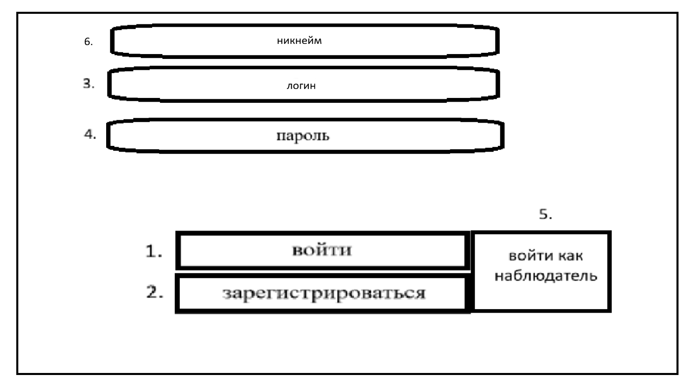
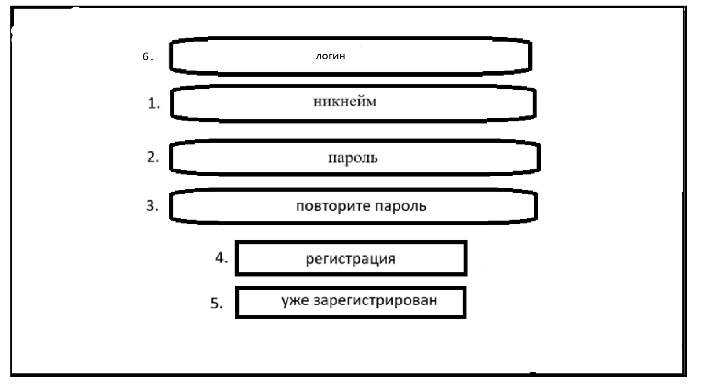
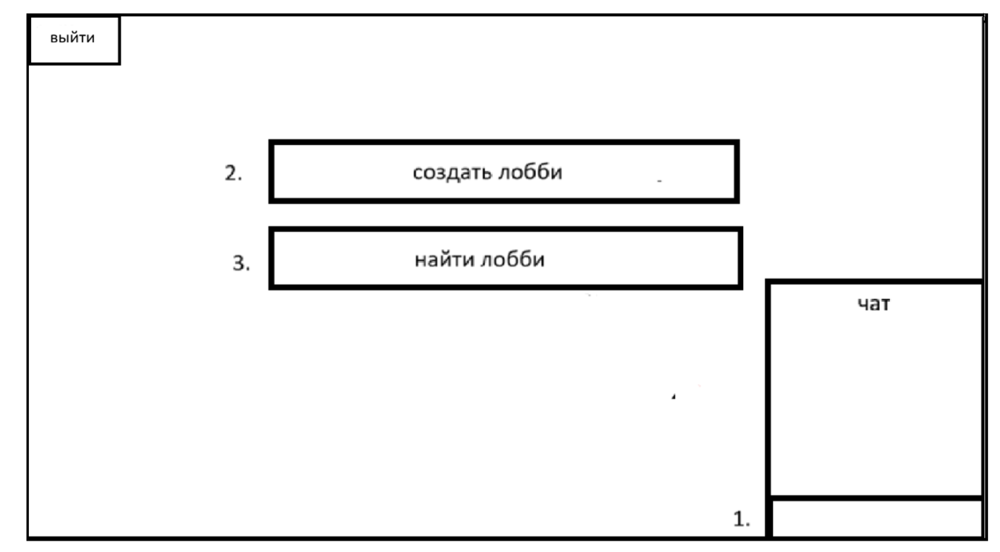
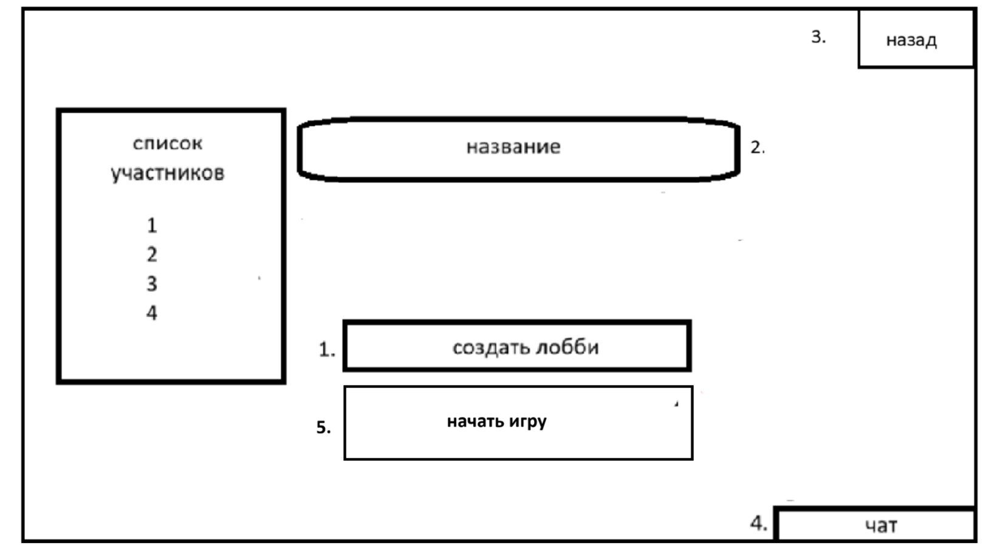
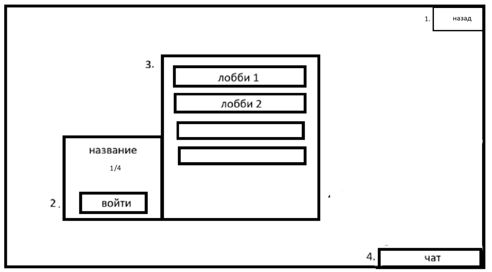
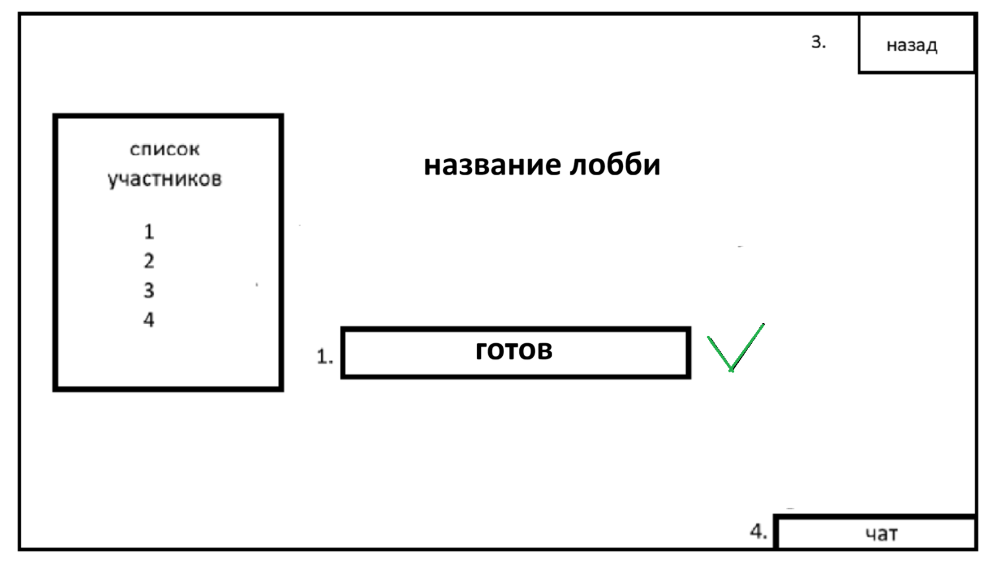
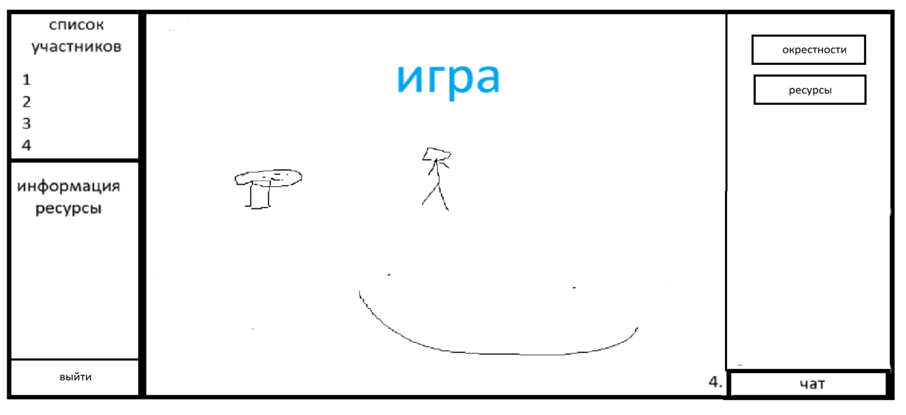

## 1. Экран входа (Начальный экран)

1. **Кнопка:** «Войти» — вход в аккаунт.
2. **Кнопка:** «Зарегистрироваться» — переход на экран регистрации.
3. **Поле ввода:** «Никнейм» — ввод никнейма.
4. **Поле ввода:** «Пароль» — ввод пароля.
5. **Кнопка:** «Войти как наблюдатель» — вход без аккаунта (режим только для просмотра).
6. **Поле ввода:** «Логин» — ввод логина.

---

## 2. Экран регистрации

1. **Поле ввода:** «Никнейм» — ввод уникального имени пользователя.
2. **Поле ввода:** «Пароль» — ввод пароля.
3. **Поле ввода:** «Повторите пароль» — подтверждение пароля.
4. **Кнопка:** «Регистрация» — создание нового аккаунта.
5. **Кнопка:** «Уже зарегистрирован» — возврат на экран входа.
6. **Поле ввода:** «Логин» — ввод логина.

---

## 3. Экран лобби

1. **Поле ввода:** «Чат» — поле для ввода сообщений в общий чат.
2. **Кнопка:** «Создать лобби» — открывает окно создания комнаты.
3. **Кнопка:** «Найти лобби» — открывает окно со списком доступных комнат.
4. **Кнопка:** «Выйти» — в углу экрана, возврат на начальный экран.

---

## 4. Экран «Создать лобби»

1. **Кнопка:** «Создать лобби» — создание новой комнаты.
2. **Поле ввода:** «название» — название для лобби.
3. **Кнопка:** «Назад» — в углу экрана, возврат в лобби.
4. **Кнопка:** «Чат» — открывает/закрывает боковую панель чата.
4. **Кнопка:** «Начать игру» 

---

## 5. Экран «Поиск лобби»

1. **Кнопка:** «Назад» — в углу экрана, возврат в лобби.
2. **Кнопка:** «Войти» — вход в выбранную комнату.
3. **Список комнат:**
   - Каждый элемент списка — кнопка.
4. **Кнопка:** «Чат» — открывает/закрывает боковую панель чата.

---

## 6. Экран ожидания

1. **Кнопка:** «Готов» — переключение статуса готовности к игре.
3. **Кнопка:** «Назад» — в углу экрана, покинуть лобби.
4. **Кнопка:** «Чат» — открывает/закрывает боковую панель чата.

---

## 7. Игровой экран

### Основная область
- **Canvas:** Игровое поле 50×50.
- Рендеринг карты, юнитов, построек и тумана войны.

### Левая панель
- **Список участников:** Слоты 1–4.
- **Информация:** Детали выделенного объекта.
- **Ресурсы:**
  - Для людей: Нефть / Железо.
  - Для грибов: Споры / Железо.
- **кнопка:** выйти.

### Правая панель
- **Чат:** Область чата и поле ввода сообщений.
- **Кнопки управления:**
  - Кнопки выбора уровней карты.
  - Дополнительные игровые кнопки.